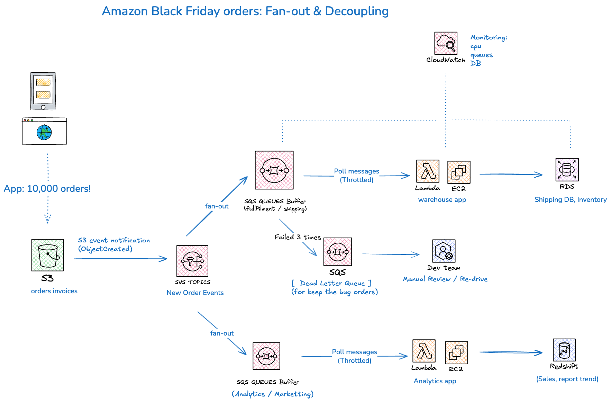
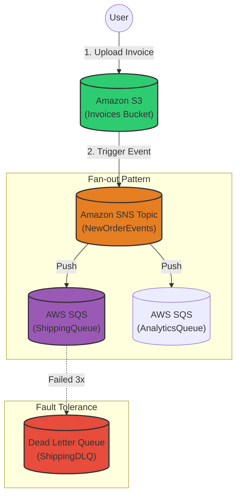

# 🛍️ Black Friday Order Processing System

ระบบจำลองการจัดการออเดอร์ปริมาณมหาศาล (High-scale Order Processing) สำหรับเทศกาล Black Friday โดยใช้ AWS Serverless Architecture

โปรเจกต์นี้สาธิตการใช้ Fan-out Pattern และ Decoupling เพื่อสร้างระบบที่รองรับ Traffic สูงโดยไม่ล่ม ด้วยการผสานพลังของ S3, SNS, และ SQS ผ่าน Python Boto3

## 🏗️ Architecture Diagram

<div align="center">
  
</div>

### Architecture Flow:

1. **App อัปโหลด 10,000 ออเดอร์** → S3 (orders invoices)
2. **S3 event notification (ObjectCreated)** → SNS Topics (New Order Events)
3. **SNS fan-out** ไปยัง SQS Queues หลายตัว:
   - **Fulfillment/Shipping Queue** → Lambda + ECS → RDS (Shipping DB, Inventory)
   - **Analytics/Marketing Queue** → Lambda + ECS → Redshift (Sales reports, trends)
4. **Error Handling**: Dead Letter Queue สำหรับข้อความที่ fail 3 ครั้ง
5. **Monitoring**: CloudWatch สำหรับ CPU, queues, DB metrics

ระบบทำงานแบบ **Event-Driven**: ทันทีที่มีไฟล์ออเดอร์ถูกอัปโหลดลง S3, ระบบจะกระจายงาน (Fan-out) ไปยังคิวต่างๆ เพื่อรอการประมวลผล



## 🚀 Key Features (สิ่งที่เรียนรู้)

**Fan-out Pattern**: การใช้ SNS กระจายข้อมูลชุดเดียวไปยังหลายปลายทาง (SQS) พร้อมกัน

**Decoupling**: การใช้ SQS เป็น Buffer กั้นกลาง เพื่อป้องกันไม่ให้ระบบปลายทาง (Consumer) ล่มเมื่อเจอ Traffic ถล่ม

**Fault Tolerance**: การตั้งค่า Dead Letter Queue (DLQ) และ Redrive Policy เพื่อดักจับข้อความที่มีปัญหา (Bug/Corrupted Data)

**Infrastructure as Code (IaC)**: การใช้ Boto3 สร้าง Infrastructure ทั้งหมดด้วย Python Script

## 📋 Prerequisites (สิ่งที่ต้องมี)

Python 3.x

AWS CLI (ติดตั้งและ Config เรียบร้อย)

```bash
aws configure
# ใส่ Access Key / Secret Key / Region (แนะนำ ap-northeast-3)
```

IAM Permissions: User ที่รันต้องมีสิทธิ์:

- AmazonS3FullAccess
- AmazonSNSFullAccess  
- AmazonSQSFullAccess

## 🛠️ How to Run (วิธีใช้งาน)

### 1. ติดตั้ง Library

```bash
pip install boto3
```

### 2. สร้าง Infrastructure

รันสคริปต์เพื่อสร้าง S3 Bucket, SNS Topic, SQS Queue และผูก Policy ทั้งหมด

```bash
python setup_infra.py
```

**ผลลัพธ์**: คุณจะได้ URL ของ SQS Queue และชื่อ S3 Bucket ที่พร้อมใช้งาน

### 3. ทดสอบระบบ (Testing)

1. เข้า AWS Console ไปที่ S3
2. อัปโหลดไฟล์อะไรก็ได้ (เช่น test.json) ลงใน Bucket `black-friday-orders-xxxxxxxx`
3. ไปที่ SQS Console ดูที่ ShippingQueue
4. กด **Send and receive messages** → **Poll for messages**
5. คุณจะเห็นข้อความใหม่เข้ามา! (ซึ่งข้างในคือ Event จาก S3)

## 📂 Project Structure

```
blackfriday-orders-project/
├── img/
│   └── amz-order-fanout-decoupling.png
├── setup_infra.py          # สคริปต์หลักสำหรับสร้าง AWS Resources
├── README.md               # English version
├── README_TH.md           # Thai version (this file)
└── requirements.txt        # Python dependencies
```

**setup_infra.py**: สคริปต์หลักสำหรับสร้าง AWS Resources และผูก Permissions (Policies)

**(Optional) producer.py**: สคริปต์จำลองการ Upload ไฟล์ลง S3

**(Optional) consumer.py**: สคริปต์จำลอง Worker ที่ดึงงานจาก SQS ไปทำ

## 🧹 Cleanup (การลบเมื่อเลิกใช้)

เพื่อป้องกันค่าใช้จ่ายส่วนเกิน อย่าลืมลบ Resources หลังเล่นเสร็จ:

- **S3**: ลบไฟล์ข้างในให้หมด แล้วลบ Bucket
- **SQS**: ลบ Queue ShippingQueue และ ShippingQueueDLQ  
- **SNS**: ลบ Topic NewOrderEvents

## 🌐 Language Versions

- [🇺🇸 English Version](README.md)
- [🇹🇭 Thai Version](README_TH.md) (this file)

---

Created for AWS Cloud Engineer Journey 🚀